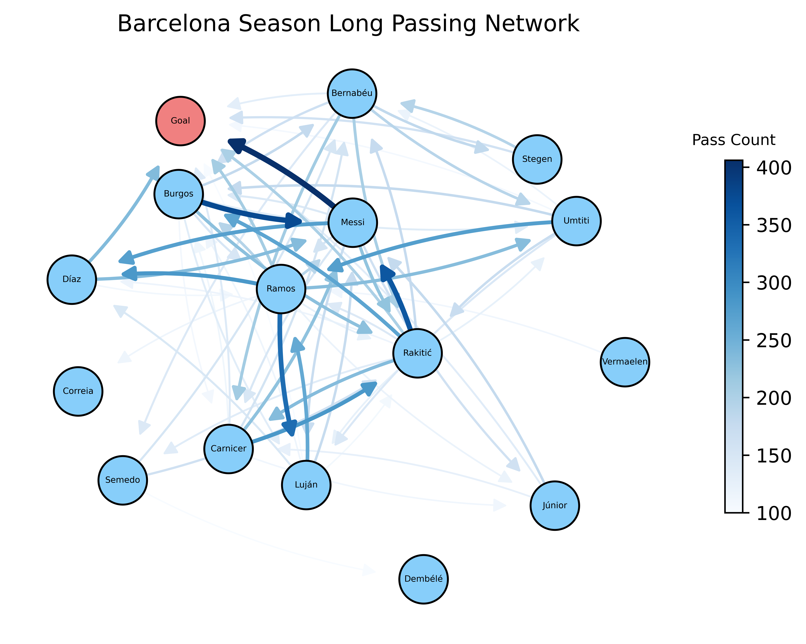

# Soccer Passing Networks

This project visualizes passing networks in soccer matches for individual teams by processing match event data and generating network diagrams that highlight player connections and passing patterns throughout a season. All data is from [StatsBomb](https://github.com/statsbomb/open-data.git). 

---
 
## Project Content
 
```
PassingNetworks/
├── Data/                       
├── Examples/
│   └── workflow.ipynb           # Example walkthrough notebook
├── Utils/
│   ├── dataCollection.py        # Fetches and preprocesses match data
│   ├── dataProcessing.py        # Processes data for visualizations
│   └── visualization.py         # Generates passing network visualizations
├── .gitignore
└── README.md
```

## Installation & Setup
 
**Requirements:** Python 3.8+
 
1. Clone the repository:
   ```bash
   git clone https://github.com/your-username/PassingNetworks.git
   cd PassingNetworks
   ```
 
2. Install dependencies:
   ```bash
   pip install -r requirements.txt
   ```
 
3. Populate the `Data/` directory by running functions in the data collection script:
   ```bash
   python Utils/dataCollection.py
   ```
 
---
 
## Usage
 
### Running the full workflow
 
The easiest way to get started is with the example notebook:
 
```bash
jupyter notebook Examples/workflow.ipynb
```
 
---
 
## How It Works
 
1. **Data Collection** — Fetches and collects match event data including passes, shots, positions, and player metadata from StatsBomb API
2. **Data Processing** — Gathers information to help with player visualization
3. **Visualization** — Renders passing networks with nodes representing players and edges representing passing frequency over the course of a season
 
---

## Results

### Passing Network

Below is an example of a passing network generated from an entire season, around 36 matches. However, this repo can be used for individual match analysis as well. For all graphs, a minimum passing threshold can be set to filter out players. 



### Passing Heatmap

This repository can also generate passing heatmaps that visualize where a player tends to distribute the ball most frequently, offering insights into their positioning, decision making, and overall influence on the game. These heatmaps can also help identify patterns such as preferred passing zones and areas of high activity.

